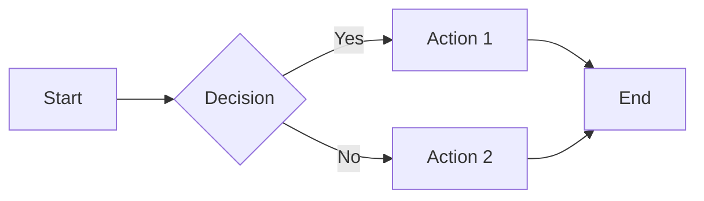
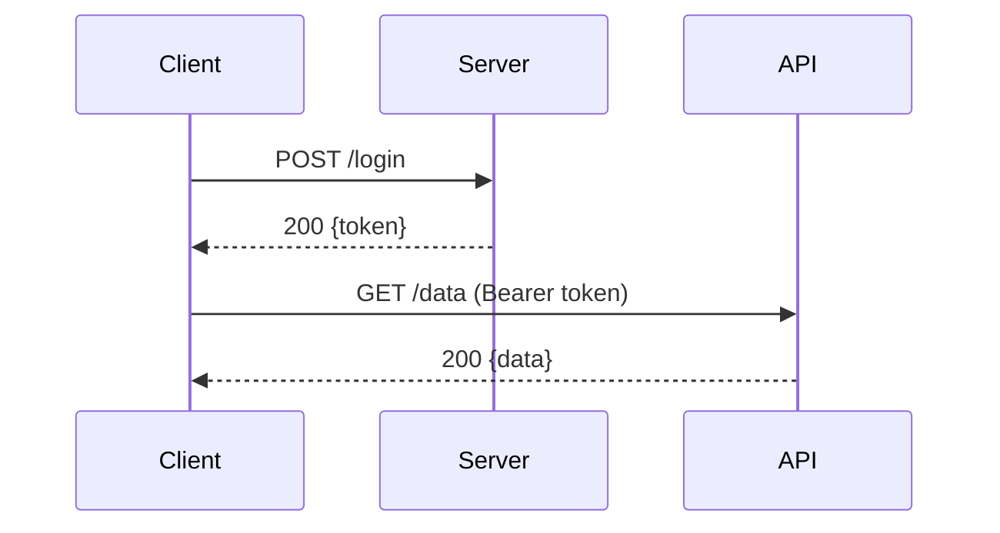

## Why Markdown Matters for Developers

Markdown is the lingua franca of developer documentation: READMEs, pull requests, issue comments, wikis, changelogs, blog posts, and technical documentation all use it. Knowing its full feature set — especially GitHub-Flavored Markdown (GFM) — makes you a noticeably better communicator.

---

## Headings

```markdown
# H1 — Page title (one per document)
## H2 — Major section
### H3 — Subsection
#### H4 — Sub-subsection
```

---

## Text Formatting

```markdown
**bold text**
*italic text*
***bold and italic***
~~strikethrough~~
`inline code`
==highlight== (some renderers)
```

---

## Links and Images

```markdown
[Link text](https://example.com)
[Link with title](https://example.com "Hover tooltip")
[Reference link][id]
[id]: https://example.com "Optional title"


[](https://example.com)
```

HTML is valid in most Markdown renderers for size control:
```html

```

---

## Code Blocks

### Inline code

```markdown
Use `console.log()` to debug.
```

### Fenced code blocks with syntax highlighting

````markdown
```javascript
const greet = (name) => `Hello, ${name}!`;
```

```python
def greet(name: str) -> str:
    return f"Hello, {name}!"
```

```bash
#!/bin/bash
echo "Hello, World!"
```
````

Common language identifiers: `javascript`, `typescript`, `python`, `go`, `rust`, `java`, `bash`, `shell`, `sql`, `yaml`, `json`, `dockerfile`, `markdown`, `html`, `css`, `diff`, `plaintext`

### Diff syntax

````markdown
```diff
- const old = "removed line";
+ const new = "added line";
  const unchanged = "same";
```
````

---

## Lists

```markdown
# Unordered
- Item 1
- Item 2
  - Nested item (2 spaces or 1 tab)
  - Another nested
- Item 3

# Ordered
1. First step
2. Second step
3. Third step

# Task list (GitHub-Flavored Markdown)
- [x] Write tests
- [x] Implement feature
- [ ] Update documentation
- [ ] Deploy to staging
```

---

## Tables (GitHub-Flavored Markdown)

```markdown
| Header 1 | Header 2 | Header 3 |
|----------|----------|----------|
| Cell 1   | Cell 2   | Cell 3   |
| Cell 4   | Cell 5   | Cell 6   |
```

### Column alignment

```markdown
| Left | Center | Right |
|:-----|:------:|------:|
| text | text   |  text |
| 1    | 2      |     3 |
```

- `:---` = left align
- `:---:` = center align
- `---:` = right align

### Tips for complex tables

- Inline code works in cells: `` `code` ``
- Links work in cells: `[text](url)`
- Bold and italic work in cells
- HTML `<br>` works for multi-line cells

---

## Blockquotes

```markdown
> Simple blockquote

> Multi-line blockquote
> continues here

> **Note:** With **formatting** inside

> Nested blockquote
>> Second level
```

### GitHub Alerts (newer GFM)

```markdown
> [!NOTE]
> Highlights information that users should take into account.

> [!TIP]
> Optional information to help a user be more successful.

> [!IMPORTANT]
> Crucial information necessary for users to succeed.

> [!WARNING]
> Critical content demanding immediate user attention due to potential risks.

> [!CAUTION]
> Negative potential consequences of an action.
```

---

## Horizontal Rules

```markdown
---
***
___
```

---

## Footnotes (GFM)

```markdown
Here's a sentence with a footnote.[^1]
Another sentence.[^longnote]

[^1]: This is the footnote.
[^longnote]: A longer footnote with multiple paragraphs.
    Indent continuation paragraphs.
```

---

## Escaping

Use backslash to escape Markdown characters:

```markdown
\*Not italic\*
\[Not a link\]
\`Not code\`
```

---

## Mermaid Diagrams (GitHub, GitLab, Notion)

GitHub renders Mermaid diagrams in Markdown files:

````markdown

````



```mermaid
erDiagram
    USER ||--o{ ORDER : places
    ORDER ||--|{ LINE-ITEM : contains
    USER { string id, string email }
    ORDER { string id, datetime placed_at }
```

---

## README Best Practices

A good project README includes:

1. **Project name and one-line description**
2. **Badges** (build status, version, license)
3. **Screenshot or demo GIF** (for UI projects)
4. **Installation** — exact copy-paste commands
5. **Quick start** — minimal working example
6. **Configuration** — environment variables, options
7. **Contributing** — how to set up dev environment
8. **License**

```markdown
# Project Name

Brief description of what it does and why someone would use it.

[](https://github.com/user/repo/actions)
[](https://www.npmjs.com/package/package-name)
[](LICENSE)

## Installation

npm install package-name

## Usage

```javascript
import { thing } from "package-name";
thing.doStuff();
```
```

---

## Markdown Tools

- **[ToolNinja Markdown Preview](/tools/markdown-preview)** — live preview with GFM support
- **[ToolNinja Markdown Table Generator](/tools/markdown-table-generator)** — build tables visually with CSV import
- **Typora** — desktop editor with live rendering
- **Obsidian** — knowledge base built on Markdown
- **mdx** — Markdown + JSX for React documentation

---

## Try It: ToolNinja Markdown Preview

Write or paste Markdown and see the rendered output instantly with the **[ToolNinja Markdown Preview](/tools/markdown-preview)**. Supports GitHub-Flavored Markdown including tables, task lists, and code blocks with syntax highlighting.
